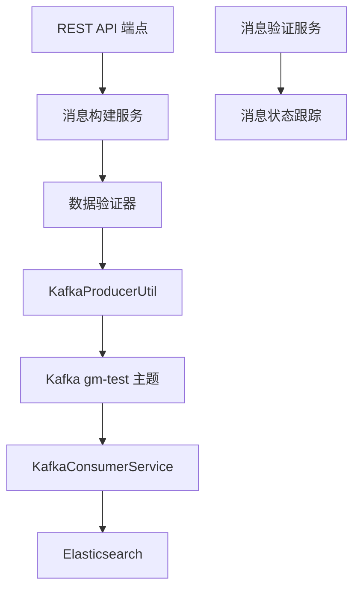

# Kafka消息发送器设计文档

## 概述

本设计文档描述了如何实现一个Kafka消息发送功能，该功能能够根据gm-test-mappings.json中定义的字段结构创建结构化消息，发送到gm-test主题，并验证消息成功添加到Kafka。

## 架构设计

### 系统架构图



### 核心组件

1. **消息构建服务 (MessageBuilderService)**
   - 负责根据gm-test-mappings.json结构创建消息
   - 支持自动生成测试数据和接收自定义数据
   - 确保消息格式符合预定义的schema

2. **数据验证器 (DataValidator)**
   - 验证输入数据的类型和格式
   - 确保必填字段存在
   - 验证嵌套对象和数组结构

3. **消息发送控制器 (Enhanced KafkaTestController)**
   - 提供REST API端点接收发送请求
   - 集成消息构建和验证功能
   - 返回详细的发送结果和跟踪信息

4. **消息验证服务 (MessageVerificationService)**
   - 跟踪消息发送状态
   - 验证消息是否被消费者成功处理
   - 提供消息处理时间统计

## 组件和接口

### 1. GmTestMessage 数据模型

```java
public class GmTestMessage {
    private Long id;
    private String title;
    private String content;
    private List<String> tags;
    private String category;
    private Integer status;
    private Integer priority;
    private Author author;
    private String createTime;
    private String updateTime;
    private String publishTime;
    private GeoPoint location;
    private Double price;
    private Integer stock;
    private List<String> images;
    private List<Attachment> attachments;
    private Metrics metrics;
    private Boolean isActive;
    private Integer version;
    private Map<String, Object> extra;
}
```

### 2. MessageBuilderService 接口

```java
public interface MessageBuilderService {
    GmTestMessage createSampleMessage();
    GmTestMessage createMessageFromInput(Map<String, Object> inputData);
    String convertToJson(GmTestMessage message);
    boolean validateMessage(GmTestMessage message);
}
```

### 3. MessageVerificationService 接口

```java
public interface MessageVerificationService {
    String generateTrackingId();
    void trackMessageSent(String trackingId, String message);
    void trackMessageReceived(String trackingId);
    MessageStatus getMessageStatus(String trackingId);
    List<MessageTrackingInfo> getRecentMessages();
}
```

### 4. 增强的REST API端点

```java
@PostMapping("/send-structured")
public ResponseEntity<MessageSendResponse> sendStructuredMessage(
    @RequestBody(required = false) Map<String, Object> customData);

@PostMapping("/send-sample")
public ResponseEntity<MessageSendResponse> sendSampleMessage();

@GetMapping("/verify/{trackingId}")
public ResponseEntity<MessageStatus> verifyMessage(@PathVariable String trackingId);

@GetMapping("/recent-messages")
public ResponseEntity<List<MessageTrackingInfo>> getRecentMessages();
```

## 数据模型

### 消息结构 (基于gm-test-mappings.json)

```json
{
  "id": 1001,
  "title": "测试文章标题",
  "content": "这是一篇测试文章的内容",
  "tags": ["测试", "Kafka", "Elasticsearch"],
  "category": "技术",
  "status": 1,
  "priority": 5,
  "author": {
    "id": 1,
    "name": "张三",
    "email": "zhangsan@example.com"
  },
  "createTime": "2024-01-15 10:30:00",
  "updateTime": "2024-01-15 10:30:00",
  "publishTime": "2024-01-15 11:00:00",
  "location": {
    "lat": 39.9042,
    "lon": 116.4074
  },
  "price": 99.99,
  "stock": 100,
  "images": ["image1.jpg", "image2.jpg"],
  "attachments": [
    {
      "name": "document.pdf",
      "url": "https://example.com/doc.pdf",
      "type": "pdf"
    }
  ],
  "metrics": {
    "views": 1000,
    "likes": 50,
    "shares": 10,
    "comments": 25
  },
  "isActive": true,
  "version": 1,
  "extra": {
    "customField": "自定义数据"
  }
}
```

### 响应模型

```java
public class MessageSendResponse {
    private String trackingId;
    private String status;
    private String message;
    private Long timestamp;
    private String topicName;
    private Integer partition;
    private Long offset;
}
```

## 错误处理

### 错误类型和处理策略

1. **数据验证错误**
   - 字段类型不匹配
   - 必填字段缺失
   - 数据格式错误
   - 处理方式：返回详细的验证错误信息

2. **Kafka发送错误**
   - 连接失败
   - 主题不存在
   - 序列化错误
   - 处理方式：重试机制和错误日志记录

3. **消息处理错误**
   - 消费者处理失败
   - Elasticsearch索引错误
   - 处理方式：错误状态跟踪和告警

### 错误响应格式

```json
{
  "success": false,
  "errorCode": "VALIDATION_ERROR",
  "errorMessage": "字段验证失败",
  "details": {
    "field": "author.email",
    "reason": "邮箱格式不正确"
  },
  "timestamp": "2024-01-15T10:30:00Z"
}
```

## 测试策略

### 单元测试

1. **MessageBuilderService 测试**
   - 测试样本数据生成
   - 测试自定义数据转换
   - 测试数据验证逻辑

2. **DataValidator 测试**
   - 测试各种数据类型验证
   - 测试边界条件
   - 测试错误场景

3. **MessageVerificationService 测试**
   - 测试消息跟踪功能
   - 测试状态更新逻辑

### 集成测试

1. **端到端消息流测试**
   - 从API调用到Kafka发送
   - 从Kafka消费到Elasticsearch存储
   - 消息验证和状态跟踪

2. **错误场景测试**
   - Kafka不可用时的处理
   - 无效数据的处理
   - 网络异常的处理

### 性能测试

1. **消息发送性能**
   - 单条消息发送延迟
   - 批量消息发送吞吐量
   - 并发发送性能

2. **消息处理性能**
   - 消费者处理延迟
   - Elasticsearch索引性能

## 实现细节

### 数据生成策略

1. **基础数据类型**
   - Long: 使用时间戳或随机数
   - String: 使用预定义模板和随机内容
   - Integer: 使用合理范围内的随机值
   - Boolean: 随机true/false
   - Double: 使用合理范围内的随机小数

2. **复杂数据类型**
   - Date: 使用当前时间或相对时间
   - GeoPoint: 使用预定义的地理坐标
   - Array: 生成合理数量的元素
   - Object: 递归生成嵌套结构

### 消息跟踪机制

1. **跟踪ID生成**
   - 使用UUID确保唯一性
   - 包含时间戳信息便于排序

2. **状态管理**
   - SENT: 消息已发送到Kafka
   - RECEIVED: 消费者已接收消息
   - PROCESSED: 消息已成功处理
   - ERROR: 处理过程中出现错误

3. **存储策略**
   - 使用内存缓存存储最近的跟踪信息
   - 可选择持久化到数据库或Redis

## 配置管理

### 应用配置

```properties
# Kafka消息发送配置
kafka.message.sender.topic=gm-test
kafka.message.sender.retry.attempts=3
kafka.message.sender.retry.delay=1000

# 消息验证配置
message.verification.cache.size=1000
message.verification.timeout=30000

# 数据生成配置
message.generator.default.author.name=测试用户
message.generator.default.category=默认分类
```

### 环境特定配置

- 开发环境：使用本地Kafka和Elasticsearch
- 测试环境：使用测试集群
- 生产环境：使用生产集群配置